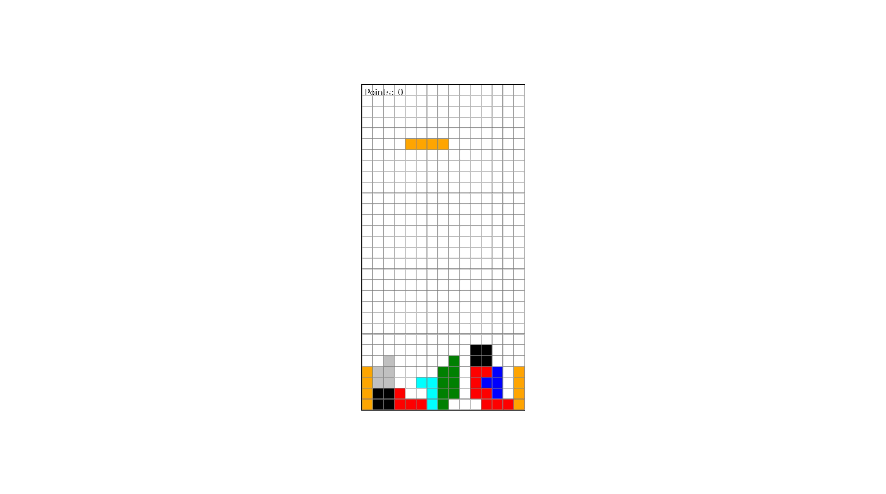

# Tetriada 🎮

Tetriada is a simple Tetris-inspired game built using JavaScript and the HTML5 Canvas API. The game features different block shapes, smooth animations, and basic collision detection.

## Features ✨

- Classic Tetris gameplay 🎲
- Randomly generated tetrominoes 🔄
- Block rotation and movement ⬅️⬆️➡️⬇️
- Score tracking 📊
- Simple and clean design 🎨

## Installation & Running the Game 🚀

1. Clone the repository:

   ```sh
   git clone https://github.com/your-repo/tetriada.git
   ```

2. Open the project folder:

   ```sh
   cd tetriada
   ```

3. Open `index.html` with Live Server:
   - Install the **Live Server** extension in VS Code (if not already installed).
   - Right-click `index.html` and select **"Open with Live Server"**.
   - The game will open in your default browser! 🌐

## How to Play 🎮

- **Left Arrow (⬅️)** - Move block left
- **Right Arrow (➡️)** - Move block right
- **Up Arrow (⬆️)** - Rotate block
- **Down Arrow (⬇️)** - Move block down faster

## Project Structure 📁

```
├── blocks.json      # Block definitions
├── index.html       # Main HTML file
├── script.js        # Game logic
├── Block.js         # Block handling class
├── Board.js         # Board management class
├── Renderer.js      # Rendering utilities
└── README.md        # This file
```

## License 📜

This project is open-source and available under the MIT License.

Enjoy playing Tetriada! 🎉

## 📸 Screenshots



## 👨‍💻 Author

Created by **Jarosław Baumgart**.

## 📜 License

This project is available under the **MIT License**.

## 📬 Contact

If you have any questions, feel free to reach out:

🔗 **GitHub:** [Jaroslaw-Baumgart](https://github.com/Jaroslaw-Baumgart)  
📧 **Email:** jaroslawbaumgart@gmail.com
